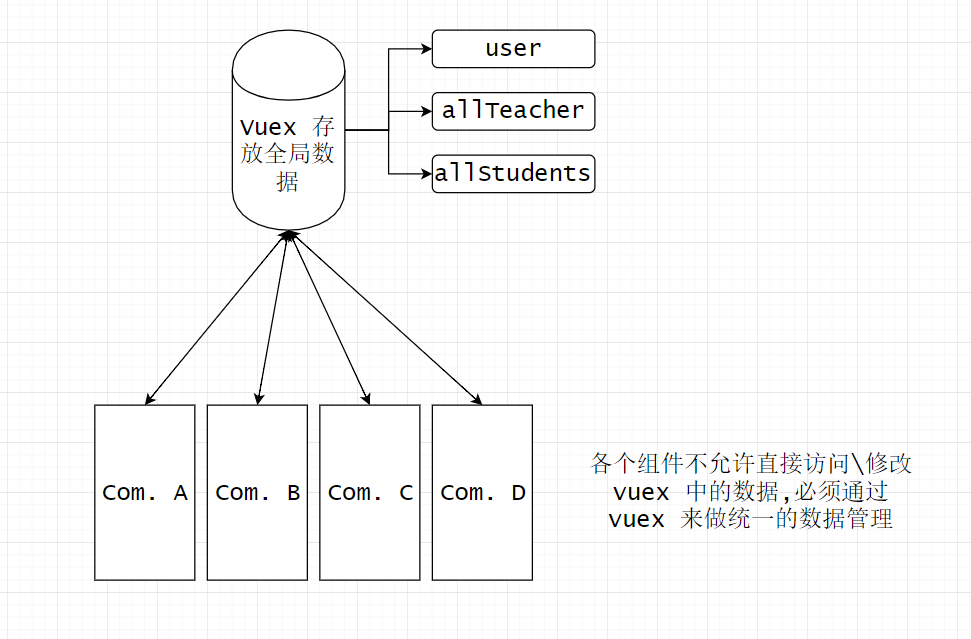

# Vue 组件数据漫游指南

### 一般有两种方式

1. 组件是父子关系

2. 组件是平行关系


### 父子关系

参照文档：https://vuejs.org/v2/guide/components.html

也可以看 `src/components/Teacher/Teacher.vue` 中的样例，
```
 <TeachList :all-users="realUser"></TeachList>
 ```
 这里 `:all-users` 就是往里面传的数据接口，在 `TeacherList` 中会有对应的 
 ```
   props: [
    'allUsers'
  ]
```
来接收传入的参数，这里要注意 `HTML` 是不区分大小写的，做法文档中也有提到。


### 非父子关系（平行）

这种数据共享在前端领域的讨论还比较多，目前还不能一概而论。猴啊采用的是最完备的（也是最复杂的）一种管理方式，用 `vuex`

#### 为什么用 `vuex`？
- 它是前端工程化中的重要里程碑，对于超大型前端工程非常有用，尤其是电商类，猴啊可以算作这一类
- 虽然复杂，但是比手动管理数据还是要简单得多
- 竞争对手都太弱鸡了（但前端风云变化，谁也说不定呢）
- 官方项目，社区完善

#### 它的问题是？
- 新手不友好，看理解它的理念要费些时间
- 可能有点过度设计，用起来略微复杂

#### 猴啊的架构
- 先看 `vuex` 的文档：https://vuex.vuejs.org/en/intro.html
- `src/store/store.js` 存放了 `vuex` 的代码
- 

#### 所以到底要怎么跨组件传数据？
1. A 把数据存到 `vuex` 中 
2. B 从 `vuex` 中获取 A 存的数据
3. 这个方法类似于全局变量，但 `vuex` 提供了一套完整的方案来规避全局变量的种种问题。

#### `reserveIsDirty` 为例
- 为了减少网络请求，用户在访问 预约 这一栏的时候，会把数据缓存到 `vuex` 中，下一次访问的时候就直接从 `vuex` 中获取数据。
- 但这样的问题是，如果用户在首页发起了一次预约，那么再去预约界面查看，会发现数据还是旧的。必须要手动刷新整个 app 才能看到，用户体验比较差。
- 解决办法是如果用户发起了预约，就设置一个 `reserveIsDirty` 的全局变量。如果在预约一栏发现数据是 dirty 的，那么就从服务器拉取新数据，如果不是 dirty 的，就用缓存的数据。
- 这里的 `reserveIsDirty` 就类似于跨组件传递数据。
- 详情请查看 `src/store/store.js` 的相关实现，在 `Reserve.vue` 中有如何获取数据，在 `TeacherList.vue` 中有如何设置数据。`ctrl+f` 开启新世界。
